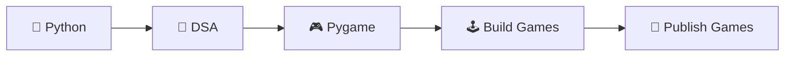

<div align="center">

# 🎮 Welcome to My Digital Playground 🎮


</div>

---


## 🎯 About Me

```python
class Developer:
    def __init__(self):
        self.name = "Jayden"
        self.language = "Python"
        self.completed_courses = [
            "Python Core",
            "Data Structures & Algorithms"
        ]
        self.current_focus = "Game Development with Python"
        self.goal = "Become a Professional Game Developer"

    def motto(self):
        return "Keep Coding. Keep Leveling Up."

me = Developer()
```

🌟 Passionate about turning ideas into interactive experiences.  
🎓 Successfully completed **Python Core** and **DSA**.  
🎮 Currently exploring **Game Development with Python & Pygame**.  
🚀 Every project is a new level in my coding adventure.

---

# ⚔️ My Skill Tree

<div align="center">

| Skill | Progress |
|-------|----------|
| 🐍 Python | ██████████ 100% |
| 🧠 DSA | ██████████ 100% |
| 🎮 Pygame | ██░░░░░░░░ 20% |
| 💻 Problem Solving | ██████████ 100% |
| 🚀 Game Development | ███░░░░░░░ 30% |

</div>

---

# 🛠️ Tech Arsenal

<div align="center">


<br><br>


</div>

---

# 🎮 Current Quest

```text
[✔] Master Python Fundamentals
[✔] Complete Data Structures & Algorithms
[🔄] Learn Pygame
[🔄] Build 2D Games
[⬜] Publish My First Game
[⬜] Become an Indie Game Developer
```

---

# 📊 GitHub Stats

<div align="center">


</div>

---

# 🕹️ Game Dev Journey

<div align="center">



</div>

---

# 🏆 Achievement Board

<div align="center">


</div>

---

# 🌌 Visitor Counter

<div align="center">


</div>

---

<div align="center">

### 🎵 While others play games, I build them.


</div>
